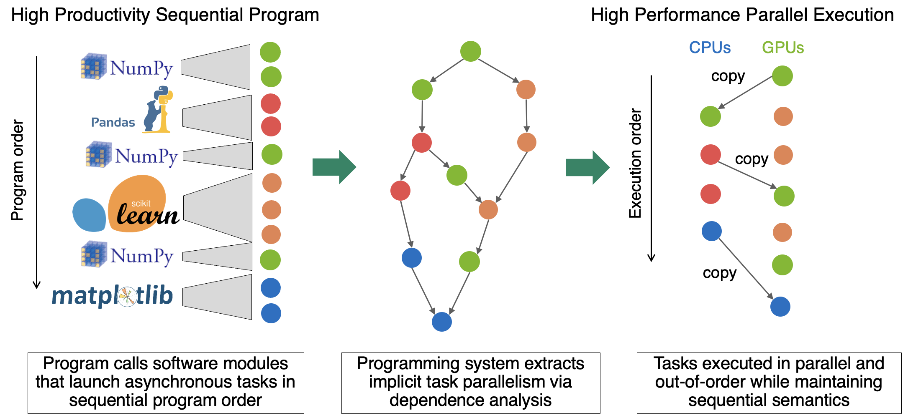

## Legion: High-Productivity High-Performance Computing ##

The vast majority of all programs are sequential. Programmers are inherently
productive when developing sequential code because they can construct more
powerful programs simply by composing functionality from one or more software modules (e.g. libraries) 
in serial without worrying about parallelism, data coherence, or synchronization. 
The productivity engendered by this facet of sequential programming is vital to the 
success of many popular software ecosystems such as Python, R, and MATLAB.
However, the implementations of these environments struggle to achieve high performance 
on parallel and distributed hardware without resorting to explicit parallelism. 
Ideally users want to write programs in a high
productivity sequential programming model and have those programs automatically executed with high performance on 
parallel hardware. Achieving this end requires the development of a nuanced programming model and
sophisticated programming systems capable of analyzing and transforming sequential programs into parallel programs.

Fortunately, there already exist
[many](https://en.wikipedia.org/wiki/Tomasulo%27s_algorithm) 
[well](https://en.wikipedia.org/wiki/Very_long_instruction_word) 
[known](https://en.wikipedia.org/wiki/Register_renaming) 
[techniques](https://en.wikipedia.org/wiki/Speculative_execution) 
[for](https://en.wikipedia.org/wiki/Instruction_pipelining)
[implicitly](https://en.wikipedia.org/wiki/Superscalar_processor)
[parallelizing](https://en.wikipedia.org/wiki/Out-of-order_execution) 
sequential programs to target parallel hardware. 
However, in most systems these algorithms are currently only deployed to exploit
fine-grained instruction-level parallelism. The primary thesis of the Legion project is 
that these same techniques can and should be deployed hierarchically at coarser granularities 
in software to leverage modern parallel hardware (multi-core CPUs, GPUs, supercomputers, etc.)
without compromising the productivity of developing sequential programs.

The basis for this thesis rests upon the fundamental observation that implicitly mapping 
sequential programs onto parallel hardware looks similar at many different scales.
At the finest granularity, hardware or compilers can extract parallelism from a stream of 
instructions by analyzing register usage and mapping independent 
instructions onto parallel hardware units. The same principles apply when extracting parallelism
from a stream of demarcated functions called *tasks* operating on *logical regions* of data to map
onto the parallel execution units inside of a workstation or a supercomputer 
for different granularities of tasks and regions. (Legion derives its name from the concatenation
of the words in 'logical region'.)

This analogy forms the basis of the Legion project, and its two primary software
artifacts can be understood as direct analogs to existing systems. The Legion
runtime endeavors to be a full reimplementation of a pipelined out-of-order superscalar processor
in software for dynamically exploiting task-parallelism from a stream of tasks
generated by the execution of a sequential program. Similarly, the Regent compiler
strives to be an optimizing compiler, performing static analyses and transformations
of programs at the coarser granularity of tasks before mapping them onto the Legion runtime.
Armed with these systems that automatically parallelize and distribute sequential programs,
we aim to facilitate the creation high productivity high performance computing ecosystems
so that all users can leverage modern massively parallel machines. 

#### The Key Ideas ####

In order to realize the above vision, the Legion project has developed several novel technologies:

* A [dynamic data model](/pdfs/oopsla2013.pdf) that is flexible enough for tasks to 
  dynamically specify arbitrary working set regions and the effects they will have on those regions.
* The ability to dynamically compute [mathematical relationships](/pdfs/dpl2016.pdf) between regions,
  and an [auto-parallelizing framework](/pdfs/parallelizer2019.pdf) for synthesizing them.
* A [dynamic dependence and distributed coherence analysis](/pdfs/visibility2023.pdf) based
  on algorithms and data structures from ray tracing to handle arbitrary aliasing of regions.
* A technique called *control replication* that decouples 
  task creation from execution to avoid sequential bottlenecks
  (with both [static](/pdfs/cr2017.pdf) and [dynamic](/pdfs/dcr2021.pdf) incarnations).
* A [scale-free programming model](/pdfs/idx2021.pdf) that encourages the development
  of programs that can be ported to run on machines of different sizes without modification.
* A *mapping interface* for [decoupling correctness from performance](/pdfs/sc2012.pdf})
  and thereby guaranteeing performance portability of programs.

Many of these ideas are intertwined and resonate with each other in the design
and we encourage you to explore them further.

#### Get Started ####

To learn more about Legion you can:

 * Read the [overview](/overview/)
 * Visit the [getting started page](/starting/)
 * Download our [publications](/publications/)
 * Ask questions on our [mailing list](/community/)

#### Acknowledgments ####

Legion is developed as an open source project, with major
contributions from [LANL](https://www.lanl.gov/),
[NVIDIA Research](https://www.nvidia.com/en-us/research/),
[SLAC](https://www6.slac.stanford.edu/), and
[Stanford](https://www.stanford.edu/). This research was supported by
the Exascale Computing Project (17-SC-20-SC), a collaborative effort
of two U.S. Department of Energy organizations (Office of Science and
the National Nuclear Security Administration) responsible for the
planning and preparation of a capable exascale ecosystem, including
software, applications, hardware, advanced system engineering, and
early testbed platforms, in support of the nation’s exascale computing
imperative. Additional support has been provided to LANL and SLAC via
the Department of Energy [Office of Advanced Scientific Computing
Research](http://science.energy.gov/ascr) and to NVIDIA, LANL and
Stanford from the U.S. Department of Energy [National Nuclear Security
Administration Advanced Simulation and Computing
Program](http://nnsa.energy.gov/asc). Previous support for Legion has
included the U.S. Department of Energy's [ExaCT Combustion Co-Design
Center](http://exactcodesign.org/) and the Scientific Data Management,
Analysis and Visualization (SDMAV) program, DARPA, the Army High
Performance Computing Research Center, and NVIDIA, and grants from
OLCF, NERSC, and the Swiss National Supercomputing Centre (CSCS).

#### Legion Contributors ####

<table>
<tr valign="middle">
<td><b>Stanford</b></td>
<td><b>SLAC</b></td>
<td><b>LANL</b></td>
<td><b>NVIDIA</b></td>
</tr>

<tr valign="middle">
<td><a href="http://theory.stanford.edu/~aiken">Alex Aiken</a></td>
<td><a href="https://elliottslaughter.com">Elliott Slaughter</a></td>
<td><a href="&#109;&#097;&#105;&#108;&#116;&#111;:&#112;&#097;&#116;&#064;&#108;&#097;&#110;&#108;&#046;&#103;&#111;&#118;">Pat McCormick</a></td>
<td><a href="http://lightsighter.org">Michael Bauer</a></td>
</tr>

<tr valign="middle">
<td>Rohan Yadav</td>
<td><a href="mail&#116;o&#58;%73%&#54;5e%6Da&#46;&#37;6Di&#37;72&#99;ha%&#54;Eda&#110;ey&#64;%73&#116;anford%2&#69;e%64u">Seema Mirchandaney</a></td>
<td><a href="&#109;&#097;&#105;&#108;&#116;&#111;:&#103;&#115;&#104;&#105;&#112;&#109;&#097;&#110;&#064;&#108;&#097;&#110;&#108;&#046;&#103;&#111;&#118;">Galen Shipman</a></td>
<td><a href="http://cs.stanford.edu/~sjt/">Sean Treichler</a></td>
</tr>

<tr>
<td>David Zhang</td>
<td>Seshu Yamajala</td>
<td>Wei Wu</td>
<td>Wonchan Lee</td>
</tr>

<tr>
<td></td>
<td>Xi Luo</td>
<td>Jonathan Graham</td>
<td><a href="http://manopapad.com/">Manolis Papadakis</a></td>
</tr>

<tr>
<td></td>
<td></td>
<td>Nirmal Prajapati</td>
<td>Irina Demeshko</td>
</tr>

<tr>
<td><b>CMU</b></td>
<td>  </td>
<td></td>
<td></td>
</tr>

<tr>
<td><a href="https://cs.stanford.edu/~zhihao/">Zhihao Jia</a></td>
<td>  </td>
<td></td>
<td></td>
</tr>

</table>
